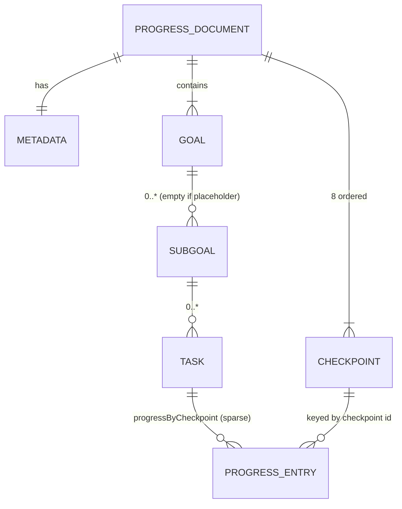

# Data Model: PIP Progress Tracker

**Feature**: `001-pip-progress-tracker` | **Date**: 2026-07-16 | **Phase**: 1 (Design & Contracts)

The single source of truth is `progress.json` (Constitution Principle I). This document describes
its entities, fields, relationships, validation rules, and computed (non-stored) values. The machine
-readable contract is [contracts/progress.schema.json](contracts/progress.schema.json).

## Entity overview

```text
Progress Document (root)
├── schemaVersion : string
├── meta : Metadata
├── checkpoints : Checkpoint[8]   (ordered; defines trend + carry-forward direction)
└── goals : Goal[]                (five PIP goals)
     └── subGoals : SubGoal[]
          └── tasks : Task[]
               └── progressByCheckpoint : { [checkpointId]: number }
```

Containment is strict: a Task belongs to exactly one SubGoal, a SubGoal to exactly one Goal, a Goal
to the Progress Document. Roll-ups aggregate upward along this tree (Principle III).

## Progress Document (root)

The single top-level object and canonical source of truth.

| Field | Type | Required | Notes |
|-------|------|----------|-------|
| `schemaVersion` | string | Yes | Semantic version of the data shape (e.g., `"1.0.0"`). Versions schema changes inside the file (FR-020, Principle §Workflow). |
| `meta` | Metadata | Yes | Tracker metadata (below). |
| `checkpoints` | Checkpoint[] | Yes | Exactly 8, in date order (FR-017). Import rejects a document missing this (FR-013). |
| `goals` | Goal[] | Yes | The PIP goals. Import rejects a document missing this (FR-013). |

**Validation**:
- Import requires both `checkpoints` and `goals` to be present; otherwise the import is rejected and
  current state is unchanged (FR-013, US4 scenario 4).

## Metadata (`meta`)

Descriptive fields for the tracker.

| Field | Type | Required | Notes |
|-------|------|----------|-------|
| `title` | string | Yes | Dashboard title (header). |
| `owner` | string | No | Tracker owner. |
| `periodStart` | string (date `YYYY-MM-DD`) | Yes | Tracking period start (baseline), `2026-07-15`. |
| `periodEnd` | string (date `YYYY-MM-DD`) | Yes | Tracking period end (due), `2026-10-15`. |
| `lastUpdated` | string (date `YYYY-MM-DD`) | Yes | Stamped on Export with the current date (FR-011). |

## Checkpoint

A biweekly reporting interval. Order in the array defines the trend sequence and the carry-forward
direction (earlier → later).

| Field | Type | Required | Notes |
|-------|------|----------|-------|
| `id` | string | Yes | Stable identifier (e.g., `"cp1"`…`"cp8"`), used as the key in `progressByCheckpoint`. Unique within the array. |
| `date` | string (date `YYYY-MM-DD`) | Yes | Checkpoint date; 14 days after the previous (FR-017). |
| `label` | string | Yes | Display label (e.g., `"Jul 15 (Baseline)"`, `"Oct 15 (Due)"`). |

**Validation / invariants**:
- Exactly 8 checkpoints, spaced 14 days apart, from `2026-07-15` to `2026-10-15` (FR-017, SC-002).
- The last checkpoint is selected on load and after Import (`selectedCheckpointId`).

## Goal

A top-level PIP objective.

| Field | Type | Required | Notes |
|-------|------|----------|-------|
| `id` | string | Yes | Stable identifier. |
| `title` | string | Yes | Goal title (card heading). |
| `outcome` | string | No | Success statement shown under the title. |
| `dueDate` | string (date) | No | All five goals are due `2026-10-15`. |
| `weight` | number | No | Roll-up weight among goals; defaults to equal weighting. All five use `1` (equal). |
| `status` | string | No | Author-supplied hint (`"in-progress"`, `"not-started"`); the displayed badge is derived from computed progress, not this field. |
| `placeholder` | boolean | Yes | `true` until sourced. A placeholder has empty `subGoals`, renders the Placeholder badge and 0%, and contributes 0% to roll-ups while still being weighted equally (FR-018, SC-008). |
| `source` | string | No | Authoritative source (URL or "PIP document") (Principle V). |
| `notes` | string | No | Free-text notes / sourcing reminders. |
| `subGoals` | SubGoal[] | Yes | May be empty (placeholder). A goal with no sub-goals rolls up to 0%. |

**State / derivation**:
- A goal is "sourced/complete" only when it has ≥ 1 sub-goal with ≥ 1 task, weights defined, and
  `placeholder: false` (FR-018, SC-008). Sourcing the four placeholder goals is future work,
  out of scope for this feature.
- Status badge (derived, `statusFor`): `placeholder` → **Placeholder** (takes precedence); else
  progress ≥ 100 → **Done**; else progress > 0 → **In progress**; else → **Not started** (FR-006).

## SubGoal

A weighted component of a goal (e.g., an AWS exam domain).

| Field | Type | Required | Notes |
|-------|------|----------|-------|
| `id` | string | Yes | Stable identifier. |
| `title` | string | Yes | Sub-goal title. |
| `weight` | number | No | Weight within the parent goal's roll-up; defaults to `1` for display, and simple-average when all siblings lack weights. |
| `tasks` | Task[] | Yes | May be empty; an empty sub-goal rolls up to 0%. |

**Validation / invariants (AWS goal, FR-019 / SC-003)**:
- The AWS goal contains a prep/logistics sub-goal (`weight: 10`) plus five exam-domain sub-goals with
  weights `31, 26, 20, 12, 11` that **sum to exactly 100** (the prep sub-goal is excluded from that sum).

## Task

The smallest tracked unit.

| Field | Type | Required | Notes |
|-------|------|----------|-------|
| `id` | string | Yes | Stable identifier. |
| `title` | string | Yes | Task title (rendered as the resource link when `resourceUrl` is set). |
| `estHours` | number | No | Estimated effort in hours (Principle V). |
| `resourceUrl` | string (URL) | No | Authoritative reference; opens in a new tab on user click only (FR-016). |
| `weight` | number | No | Weight within the sub-goal; **defaults to 1** when absent, yielding a simple/equal average across sibling tasks (FR-003). |
| `progressByCheckpoint` | object map | Yes | Keys are checkpoint `id`s; values are numbers 0–100. Sparse maps are allowed (carry-forward fills gaps). Slider edits write `progressByCheckpoint[selectedCheckpointId]` (step 5). |

**Validation / invariants**:
- Recorded values are clamped to `[0, 100]` (`clamp`); non-numeric/NaN → 0.
- Editing occurs only for the active checkpoint (FR-008); step is 5 (slider range 0–100 step 5).

## Computed values (NOT stored)

These are derived at render time from the stored data; they are never persisted.

| Value | Definition |
|-------|-----------|
| Task progress at checkpoint | Value recorded at that checkpoint, else the most recent prior recorded value (carry-forward), else 0 (FR-004). |
| Sub-goal progress at checkpoint | Weighted average of its tasks' progress (task weight defaults to 1) (FR-003). |
| Goal progress at checkpoint | Weighted average of its sub-goals' progress by sub-goal `weight`; 0 if no sub-goals. |
| Overall progress at checkpoint | Weighted average of all goals' progress by goal `weight`. |
| Weighted-average fallback | If the summed weights are 0, use a simple mean of the children (or 0 if none). |
| Rounding | Applied for **display only**; stored values and intermediate computations remain unrounded (FR-003, clarified). |
| Status badge / bar color | Derived thresholds — badge Done/In progress/Not started (Placeholder precedence); bar `good` ≥ 80, `warn` < 34, neutral otherwise (FR-006, FR-006a, SC-009). |

## Relationships (ER diagram)



## Example (abridged, from the seeded `progress.json`)

```json
{
  "schemaVersion": "1.0.0",
  "meta": { "title": "PIP Progress Tracker", "periodStart": "2026-07-15", "periodEnd": "2026-10-15", "lastUpdated": "2026-07-16" },
  "checkpoints": [ { "id": "cp1", "date": "2026-07-15", "label": "Jul 15 (Baseline)" } ],
  "goals": [
    {
      "id": "goal-aws-cert", "title": "Level 3 Certification: AWS …", "placeholder": false, "weight": 1,
      "subGoals": [
        { "id": "sg-prep", "title": "Exam Prep & Logistics", "weight": 10, "tasks": [ { "id": "t-guide", "title": "Review exam guide", "estHours": 3, "resourceUrl": "https://docs.aws.amazon.com/aws-certification/latest/ai-professional-01/", "progressByCheckpoint": { "cp1": 0 } } ] },
        { "id": "sg-d1", "title": "Domain 1 …", "weight": 31, "tasks": [] }
      ]
    },
    { "id": "goal-pocs", "title": "POC Technical Demonstrations …", "placeholder": true, "weight": 1, "subGoals": [] }
  ]
}
```
